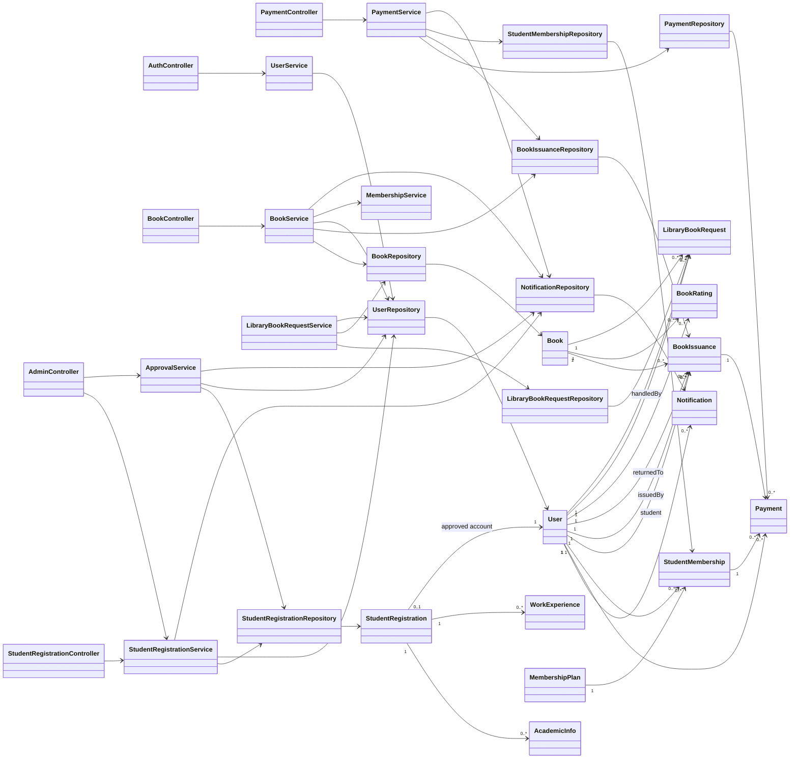
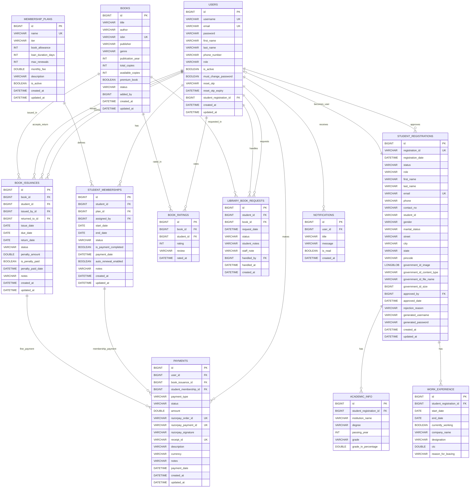
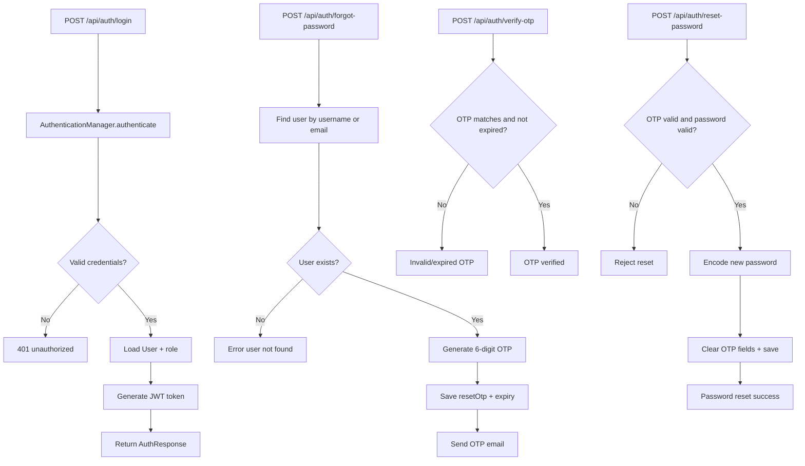
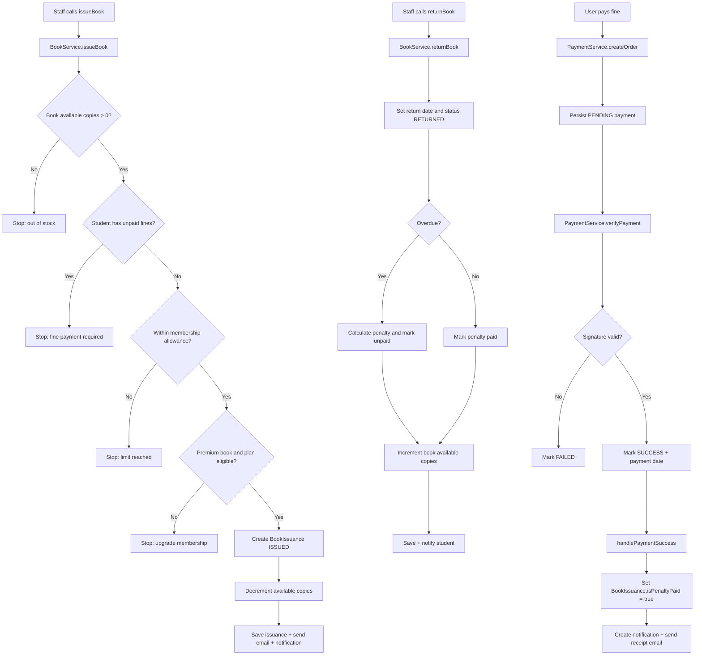

# LMS Portal UML, SQL Schema, and Control Flow Diagrams

This document provides:
1. UML architecture/class-level relationships
2. SQL table structure and foreign-key relations (ER)
3. Control flow charts for key backend workflows

## 1) UML Architecture Diagram



## 2) SQL Table Structure + Relations (ER Diagram)



## 3) Control Flow Charts

### 3.1 Student Registration + Admin Approval

```mermaid
flowchart TD
		A[Student submits /api/student/register multipart form] --> B[StudentRegistrationController.registerStudent]
		B --> C[StudentRegistrationService.registerStudent]
		C --> D{Email null/empty?}
		D -- Yes --> E[Throw runtime error]
		D -- No --> F{Email exists in student_registrations?}
		F -- Yes --> G[Duplicate email error]
		F -- No --> H[Validate document + build StudentRegistration]
		H --> I[Save registration PENDING]
		I --> J[Attach academic/work experience + BLOB]
		J --> K[Save registration again]
		K --> L[Send confirmation email]
		L --> M[Create Notification for all admins]
		M --> N[Return CREATED response with registrationId]

		N --> O[Admin reviews pending registration]
		O --> P[POST /api/admin/registrations/{id}/approve]
		P --> Q[ApprovalService.approveRegistration]
		Q --> R{Status is PENDING?}
		R -- No --> S[Reject with error]
		R -- Yes --> T[Generate username/password]
		T --> U[Create User account]
		U --> V[Mark registration APPROVED and link user]
		V --> W[Send approval email with credentials]
		W --> X[Create user notification Registration Approved]
		X --> Y[Return approval payload]
```

### 3.2 Authentication + Forgot Password



### 3.3 Book Issuance + Return + Fine Payment



## Notes

- Diagram source is based on current Spring entities/services/controllers in the backend module.
- Embedded fields from `StudentRegistration.PersonalDetails` and `StudentRegistration.Address` are represented as flattened columns inside `student_registrations`.
- Enums such as `PaymentStatus`, `PaymentType`, and status enums are modeled as string columns in ER diagrams.
